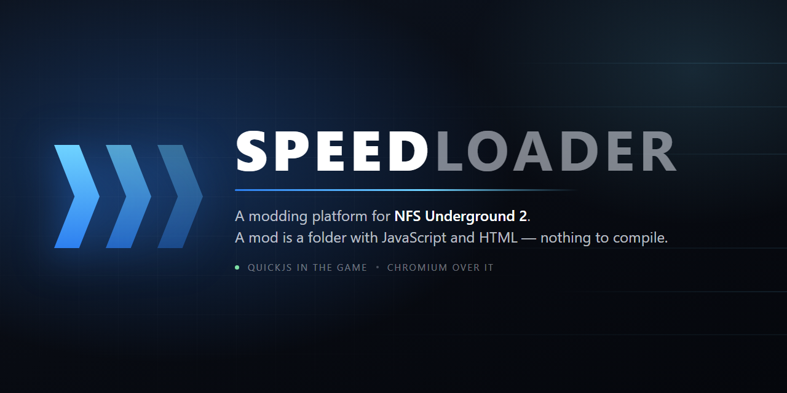

<p align="center">
  
</p>

# SpeedLoader

A modding platform for **NFS Underground 2** (`SPEED2.EXE` v1.2 NTSC, 4,800,512
bytes). A mod here is a folder with JavaScript and HTML:

```
mods/my-mod/
  mod.json        id, name, which file is the entry point, which one is the UI
  main.js         logic: runs inside the game, calls native functions
  ui/index.html   interface: runs in Chromium, on top of the game
```

Nothing to compile. The native SDK (`speed.*`) gives you the game's memory,
functions and objects; the HTML layer is a real Chromium — CSS, DevTools,
`fetch`, everything you already know.

**Writing a mod is what this project is for: the full guide is in
[docs/MODDING.md](docs/MODDING.md).** What follows is the short version.

Already have an `.asi` written in C++? It can borrow the Chromium layer for its
interface, with one header and no JavaScript at all:
[docs/NATIVE_PLUGINS.md](docs/NATIVE_PLUGINS.md).

## Writing a mod

`mod.json`:

```json
{
  "id": "my-mod",
  "name": "My mod",
  "main": "main.js",
  "ui": "ui/index.html",
  "enabled": true
}
```

`main.js` — runs inside the game. `import` of neighbouring files works (they
are ES modules). For editor completion, point at the `.d.ts`:

```js
/// <reference path="../../sdk/speedloader.d.ts" />

speed.on("frame", () => {
  const t = speed.game.telemetry();
  if (t) speed.ui.send("rpm", Math.round(t.rpm));
});

// Raw memory and native calls, for whatever the SDK does not wrap:
const gameflow = speed.mem.readU32(speed.game.addr.gameFlowManager);
speed.call(0x5FAE20, [speed.game.player()], { conv: "thiscall" });
```

`ui/index.html` — runs in Chromium. It is not a whole page: it is the fragment
that goes into its own shadow root, with `speedloader`, `root` and `mod` in
scope for its `<script>` tags.

```html
<style> .hud { position: absolute; right: 24px; bottom: 24px; } </style>
<div class="hud"><span id="rpm">0</span> rpm</div>
<script>
  speedloader.on("rpm", (v) => root.getElementById("rpm").textContent = v);
</script>
```

One detail that saves time: the page finishes mounting after `main.js` is
already running. Have the UI send a "ready" message and answer it from the mod,
like the example does.

That is the shape of it. Everything else — events, telemetry, the in-game
console and its `/commands`, saving per career car, sound, memory and native
calls, drawing inside the 3D scene, and the habits that keep a mod from
crashing someone else's game — is in
**[docs/MODDING.md](docs/MODDING.md)**.

## The example

| Mod | What it shows |
|---|---|
| `mods/tachometer` | an HTML dial fed by `speed.game.telemetry()`, throttled to 30 Hz: the mod half, the page half, and the message between them |

Speed comes from the car mirror (`player+0x04`, `+0x42C`, in m/s), the same
copy that feeds the game's own dial. Reading it is cheap and reliable; writing
to it does nothing, because physics ignores it (see `NOTES.md`).

## Interfaces for native mods

A mod written in C or C++ does not need the JavaScript side to get an
interface. It includes [`sdk/speedloader.h`](sdk/speedloader.h), asks for a
panel and talks to it by message:

```c
if (!sl)    { sl = SL_Connect(); return; }            // from your loop hook
if (!panel) { panel = sl->panel_open("mymod", "MyMod\\ui.html"); return; }

sl->panel_send_number(panel, "rpm", CurrentRpm());
```

The page is the same fragment a JavaScript mod writes, in the same shadow root,
on the same channels — the shell cannot tell the two apart. There is no library
to link: the header finds SpeedLoader in the process at runtime, so your mod
still loads on a machine without it. Details in
[docs/NATIVE_PLUGINS.md](docs/NATIVE_PLUGINS.md), and a complete mod in one
file in [`examples/asi-plugin/`](examples/asi-plugin).

## How it works

Everything lives inside the game process:

| Layer | What it does |
|---|---|
| `SpeedLoader.asi` | injected by the `.asi` loader; plants the hooks |
| QuickJS | runs each mod's `main.js`, on the game thread |
| CEF (Chromium) | renders the UI off-screen, into memory |
| D3D9 hook | composites the UI over the game, inside `EndScene` |
| `SpeedLoaderHelper.exe` | Chromium's subprocesses (renderer, gpu) |
| host API | the same UI, lent to `.asi` mods written in C++ |

`main.js` and the page share no memory: they talk by message
(`speed.ui.send` on one side, `speedloader.on` on the other), with JSON in
between.

```
main.js  --speed.ui.send("telemetry", {...})-->  ui/index.html
main.js  <--speedloader.send("ready", {...})--   ui/index.html
```

## Build

You need Visual Studio 2022 with the C++ toolset (x86). Everything else the
build handles on its own — CEF is downloaded on first use (~147 MB) and QuickJS
comes in through FetchContent.

```
build.bat                    build and install into F:\Games\NFSU2\scripts
build.bat nomod              build only
.\install.ps1 -ModsOnly      refresh mods and UI without touching Chromium
.\run.ps1 -Seconds 40        launch the game with focus and return the log
.\shot.ps1 -Out x.png        capture the game window
.\release.ps1                package a build for distribution
```

To install elsewhere: `.\install.ps1 -Game "D:\Games\NFSU2"`.

The game must be closed to install the `.asi`; with it running, use
`-ModsOnly` and press F5 in-game to reload the UI.

## Packaging a release

`release.ps1` stages a drop-in build into `release\` - ignored by git, so none
of it is ever committed:

```
release\SpeedLoader-0.1.0\
  INSTALL.txt
  LICENSE.txt                ours, plus CEF's, QuickJS's and the loader's
  dinput8.dll                Ultimate ASI Loader, so the player needs nothing else
  scripts\                   copied into the game folder, as it is
```

```
.\release.ps1                          build if needed, stage and zip
.\release.ps1 -Version 1.0.0           name the package
.\release.ps1 -Mods tachometer         ship only these mods
.\release.ps1 -NoZip                   leave the folder, skip the .zip
.\release.ps1 -NoAsiLoader             package without the loader
```

Whoever unpacks it drops everything into the folder with `SPEED2.EXE`, the same
way ExtraOptions is installed: `dinput8.dll` is [Ultimate ASI
Loader](https://github.com/ThirteenAG/Ultimate-ASI-Loader) (MIT, fetched by
`tools\fetch_asi_loader.ps1` on the first package), and whoever already has an
`.asi` loader just keeps theirs. The Chromium runtime is most of the ~330 MB.

## Keys

| Key | What it does |
|---|---|
| F1 | hands keyboard and mouse to the UI, and back to the game |

F1 is configurable in the ini and is the only key the loader itself takes; any
other key belongs to a mod and is plain JavaScript (`speed.on("keydown", ...)`).
A mod can reload its own page the same way — `speed.ui.reload(true)` on a key —
which is how you iterate on HTML without restarting the game.

## Configuration

`SpeedLoader.ini`, next to the `.asi` (the installer never overwrites yours):

| Key | What it does |
|---|---|
| `[UI] Enabled` | 0 disables Chromium; mods keep running |
| `[UI] ToggleKey` | key that hands input to the UI (0x70 = F1) |
| `[UI] Url` | page to load; empty = the shell that mounts each mod's UI |
| `[UI] DevTools` | 1 opens DevTools on startup |
| `[UI] TestPattern` | 1 replaces the content with a checkerboard (diagnostic) |
| `[Mods] Dir` | mods folder |
| `[Hooks] MainLoopSite` | where we attach to the main loop |

To develop the UI with hot reload, point `Url` at your dev server
(`http://localhost:5173`) — everything else stays the same.

## Living with other mods

The `.asi` attaches at `0x581475`, a `call` to an empty stub in the main loop.
`NFSU2ExtraOptions` uses the neighbouring one (`0x581470`) and `Pops` uses the
same one — which is why SpeedLoader **chains** to the previous target instead
of taking its place: all three run.

## Log

`scripts\SpeedLoader.log`, prefixed by layer (`core`, `gfx`, `cef`, `js`,
`in`). Mod `console.log` lands there; so does the page's `console.log`, through
`OnConsoleMessage`. Chromium's own log goes to `SpeedLoaderCef.log`.

## Contributing

Pull requests are welcome — mods, SDK surface, fixes, documented addresses —
and are merged after review and approval. The details, and what a reviewable
PR looks like, are in [CONTRIBUTING.md](CONTRIBUTING.md).

## License

[CC BY-NC 4.0](LICENSE) — Copyright (c) 2025 Chrystian Farias.

You may use, modify and redistribute this, including your own forks and
derivative mods, as long as you **credit Chrystian Farias** and link back to
<https://github.com/chrystianfarias/SpeedLoader>, and as long as it is **not
for commercial purposes**. For a commercial license, ask.

## Credits

[NFSU2ExtraOptions](https://github.com/ExOptsTeam/NFSU2ExOpts) by the ExOpts
Team — the reverse-engineering reference behind most of the game addresses used
here. Its source is GPLv3 and is not redistributed in this repository.

[CEF](https://bitbucket.org/chromiumembedded/cef) (BSD 3-Clause) and
[QuickJS](https://bellard.org/quickjs/) (MIT), both fetched at build time.

Not affiliated with, endorsed by, or sponsored by Electronic Arts. No game
asset or game code is distributed here — you bring your own copy of the game.
