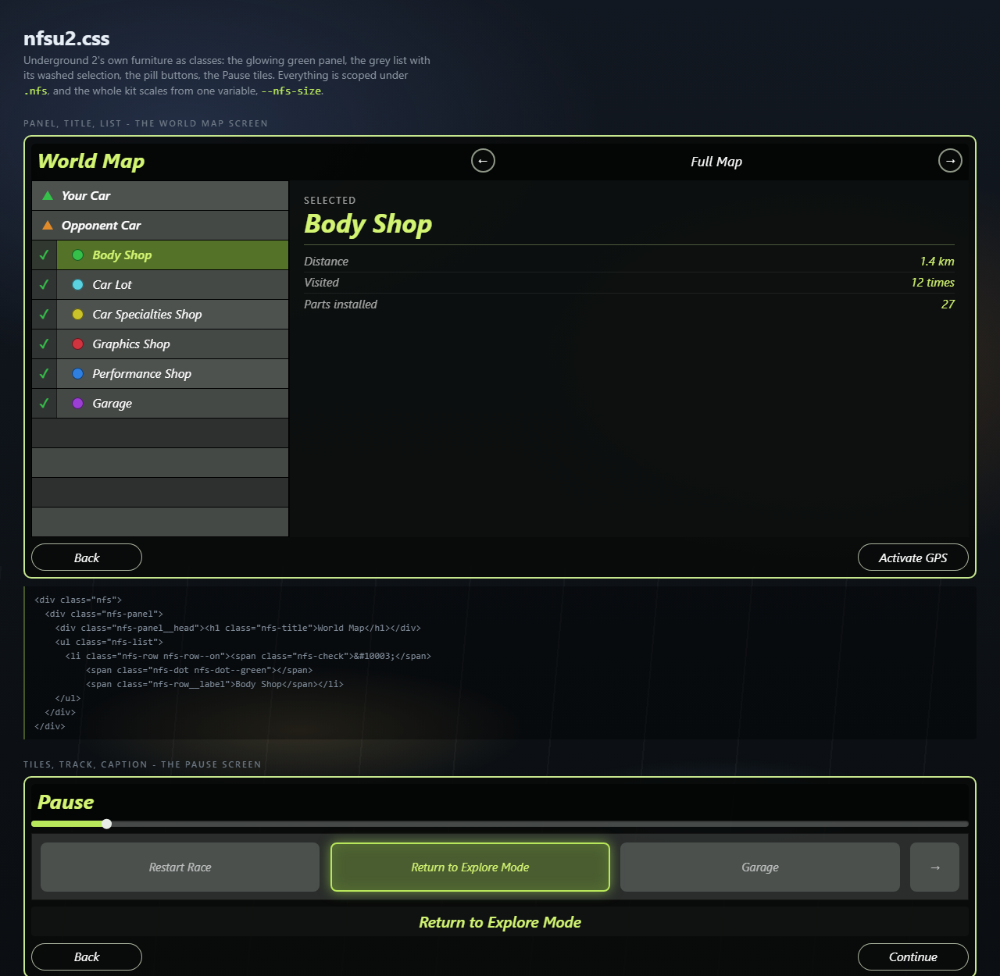

# nfsu2.css — the game's interface, as a stylesheet

Underground 2's menus are a small, consistent system: a translucent black panel
outlined in yellow-green, a bold italic title in that same green, flat grey rows
with the selected one washed green, and pill buttons with a thin bright edge.
`ui/nfsu2.css` is that system as classes, so a mod's panel looks like it shipped
with the game instead of like a web page over it.

Every surface is flat — no gradients — and there is exactly one glow in the kit,
on the selected tile. That is the point of it: one thing lights up, so the eye
knows where to go.

It installs with the loader (it lives next to `shell.html`), so there is
nothing to copy into your mod.

**To see it without starting the game, open
[`docs/ui/kit.html`](ui/kit.html) in a browser.** Every component is on that
page, over a dark backdrop that stands in for the road. Edit the CSS, hit
refresh.



## Using it

```html
<link rel="stylesheet" href="nfsu2.css">

<div class="nfs nfs-at nfs-at--tl">
  <div class="nfs-panel">
    <div class="nfs-panel__head">
      <h1 class="nfs-title">My Mod</h1>
    </div>
    <div class="nfs-panel__body">
      <ul class="nfs-list">
        <li class="nfs-row nfs-row--on"><span class="nfs-row__label">Selected</span></li>
        <li class="nfs-row"><span class="nfs-row__label">Another</span></li>
      </ul>
    </div>
    <div class="nfs-panel__foot">
      <button class="nfs-btn">Back</button>
      <button class="nfs-btn">Continue</button>
    </div>
  </div>
</div>
```

Two things about that `href`. It has no path in it because the shell clones
your `<link>` into its own document, so the URL resolves from `shell.html` —
plain `nfsu2.css` finds the file from any mod, at any depth. And it works
through a shadow root: the stylesheet lands inside yours, and nothing of it
leaks out to another mod.

Everything is scoped under `.nfs`, which has to be on an ancestor of whatever
you style. That is deliberate: a panel of the game's furniture is usually one
part of a mod's screen, not all of it.

## Sizing

One variable. `--nfs-size` is the base font size everything else is measured
from, so a panel scales whole:

```html
<div class="nfs" style="--nfs-size: 22px"> ... </div>
<div class="nfs nfs--sm"> ... </div>   <!-- 12px -->
<div class="nfs nfs--lg"> ... </div>   <!-- 19px -->
```

Worth setting from the page: the same HUD runs at 1024×768 and at 4K, and the
overlay does not scale for you.

## Placing it

Your mod's layer already covers the screen and is click-through. `.nfs-at`
puts a panel in a corner of it:

```html
<div class="nfs nfs-at nfs-at--br"> ... </div>
```

`--tl`, `--tr`, `--bl`, `--br`, `--center`, or set `--nfs-top` / `--nfs-right`
/ `--nfs-bottom` / `--nfs-left` yourself.

A `.nfs-panel` turns clicks back on for itself (`pointer-events: auto`), so a
button inside it is clickable — once the player has pressed **F1** and the UI
has the mouse.

## The classes

### Panel

| | |
|---|---|
| `.nfs-panel` | the outlined, translucent window |
| `.nfs-panel--plain` | one without a head or a foot: just padding |
| `.nfs-panel__head` | the darker title bar |
| `.nfs-panel__body` | the content |
| `.nfs-panel__foot` | the row of buttons at the bottom |
| `.nfs-title` | bold italic, bright green — the screen's name |
| `.nfs-subtitle` | white, centred — what it is showing ("Full Map") |
| `.nfs-label` | small, spaced, uppercase — a field's name |
| `.nfs-caption` | green, centred — the name of what is selected above it |
| `.nfs-rule` | a thin green rule between sections |
| `.nfs-split`, `.nfs-split__side`, `.nfs-split__main` | the World Map's two columns |

### List

| | |
|---|---|
| `.nfs-list` | the stack of bars |
| `.nfs-row` | one bar; alternate rows darken on their own |
| `.nfs-row--on` | selected: washed green, green text (also `aria-selected="true"`) |
| `.nfs-row--head` | a heading row, like "Your Car" |
| `.nfs-row--empty` | the filler the game draws to the bottom of a panel |
| `.nfs-row--clickable` | pointer cursor and a hover state |
| `.nfs-row__label` | the text; it ellipsises |
| `.nfs-row__value` | a value on the right, tabular |
| `.nfs-check` | the tick in its own darker gutter (`.nfs-check--off` keeps the space) |
| `.nfs-dot` | a legend dot: `--green --cyan --yellow --red --blue --purple` |
| `.nfs-tri` | the little triangle that marks a car (`--orange` for the rival) |

### Controls

| | |
|---|---|
| `.nfs-btn` | the pill button; `--wide`, `--block` |
| `.nfs-btn.is-on` | the selected look, for when you drive focus yourself |
| `.nfs-btn[disabled]`, `.is-off` | dimmed, no glow |
| `.nfs-btn-round` | the circular arrow button from a header |
| `.nfs-tiles`, `.nfs-tile`, `.nfs-tile--on` | the Pause screen's row of icons; `--on` is the one glow in the kit |

`:hover` and `:focus-visible` already turn a button's edge and label green, so
a mod driven by the keyboard only has to move `.is-on`. Buttons do not glow —
only `.nfs-tile--on` does.

### Readouts

| | |
|---|---|
| `.nfs-readout` | a big green tabular number, for mid-race reading |
| `.nfs-kv`, `.nfs-kv__k`, `.nfs-kv__v` | a label and its value on one line |
| `.nfs-track`, `.nfs-track__fill`, `.nfs-track__knob` | a bar; set `--value` from 0 to 1 |

```html
<div class="nfs-track" style="--value: .72"><div class="nfs-track__fill"></div></div>
```

## The palette

Every colour is a variable on `.nfs`, so a mod that wants the shapes without
the green only overrides a few:

```css
.nfs { --nfs-green: #ff9d3a; --nfs-edge: #ffcf94; --nfs-green-glow: rgba(255, 160, 60, .55); }
```

| | |
|---|---|
| `--nfs-green`, `--nfs-green-bright`, `--nfs-green-dim`, `--nfs-green-glow` | the identity |
| `--nfs-edge`, `--nfs-edge-soft` | the panel outline |
| `--nfs-ink`, `--nfs-ink-soft`, `--nfs-ink-dim` | text |
| `--nfs-panel`, `--nfs-panel-head` | the window fills |
| `--nfs-row`, `--nfs-row-alt`, `--nfs-row-empty`, `--nfs-row-on`, `--nfs-gutter`, `--nfs-row-line` | the list |
| `--nfs-btn`, `--nfs-btn-edge` | buttons |
| `--nfs-pin-*` | the six map-pin colours |
| `--nfs-size`, `--nfs-radius` | scale and corner |

## The font

The game's face is not a font that ships with Windows, and this does not bundle
one — a mod that runs offline inside a 2004 executable should not wait on a web
font. The stack is Segoe UI / Arial Narrow with the italic that carries most of
the resemblance. If you have the real thing as a `.woff2` next to your page, an
`@font-face` in your own `<style>` and one line is all it takes:

```css
.nfs { font-family: "Your Font", "Segoe UI", sans-serif; }
```

## Native mods too

Nothing here is JavaScript, so an `.asi` mod using the
[host API](NATIVE_PLUGINS.md) gets it the same way: the `<link>` goes in the
HTML file you hand to `panel_open`, and the rest is the classes above.
